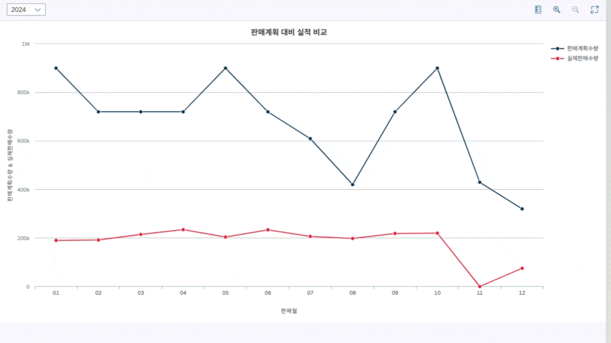

## 안녕하세요. 윤소영입니다.

<br>

<div style="border: 2px solid #F77623; border-radius: 8px; overflow-x: auto;" align=center>


|                       이름(담당 모듈)                        | UI5 프로그램                                                 |
| :----------------------------------------------------------: | :----------------------------------------------------------- |
| **윤소영(SCM)<br><br>[](https://github.com/usern77)** | ⚬ [B2B] 판매운영계획 상신 프로그램<br>⚬ [B2B] 월별 판매실적 비교 프로그램<br> |

</div>

  <br>
  <br>

<div align=center><h1>🖥️Tech. Stacks🖥️</h1></div>

<div align=center> 
  
   
   
   
  <br>

  
  <br>

  
  <br>
  
  <br>

  
  <br>

</div>
<br>


<br>


# [SD] 판매운영계획 상신 프로그램
### UI5 프로젝트


- ODATA를 이용해 판매운영계획 상신 프로그램 생성
- 판매운영계획문서 리스트가 뜨며 행을 더블클릭하면 아래에 Item 리스트가 뜬다
- 판매계획 연도(리스트박스)와 판매계획번호(서치헬프)를 선택하면 필터링 되어 데이터가 나온다.
- 승인 버튼을 누르면 상신상태 아이콘이 변한다
- 반려 버튼을 누르면 반려 사유를 적을 수 있는 팝업창이 뜨고 확인 버튼을 누르면 진행상태가 취소되며 반려사유 아이콘이 활성화된다.
- 중단 버튼을 누르면 진행상태가 중단으로 바뀐다
- 반려사유 버튼을 누르면 반려사유가 적힌 팝업창이 뜬다

## GET_ENTITY

```ABAP
METHOD SOP_HEADERSET_GET_ENTITY.

 DATA(LS_SOPNUM) = IT_KEY_TAB[ NAME = 'Sopnum' ]-VALUE.
 DATA(LS_CTRYCODE) = IT_KEY_TAB[ NAME = 'Ctrycode' ]-VALUE.

  SELECT SINGLE *
   FROM ZVBSD0011 AS A
   WHERE A~SOPNUM = @LS_SOPNUM
     AND A~CTRYCODE = @LS_CTRYCODE
   INTO @DATA(LS_DATA).

  IF SY-SUBRC <> 0.
    RAISE EXCEPTION TYPE /IWBEP/CX_MGW_BUSI_EXCEPTION.
  ENDIF.

  MOVE-CORRESPONDING LS_DATA TO ER_ENTITY.
ENDMETHOD.
```

## UPDATE_ENTITY

```ABAP
METHOD SOP_HEADERSET_UPDATE_ENTITY.

  DATA(LS_SOPNUM) = IT_KEY_TAB[ NAME = 'Sopnum' ]-VALUE.
  DATA(LS_CTRYCODE) = IT_KEY_TAB[ NAME = 'Ctrycode' ]-VALUE.

  DATA LS_DATA TYPE ZTBSD0010.

  IO_DATA_PROVIDER->READ_ENTRY_DATA(
    IMPORTING
      ES_DATA = LS_DATA
  ).

  UPDATE ZTBSD0010
    SET Appr = @LS_DATA-APPR,
        Status = @LS_DATA-STATUS,
        Rejreason = @LS_DATA-REJREASON
  WHERE Sopnum = @LS_SOPNUM
    AND Ctrycode = @LS_CTRYCODE.

  IF SY-SUBRC <> 0.
    RAISE EXCEPTION TYPE /IWBEP/CX_MGW_BUSI_EXCEPTION.
  ENDIF.

ENDMETHOD.
```

## PUT (UPDATE)

````js
 update: async function (oUpdateData) {
    let oTable = this.byId("tabHeader");
    let aSelectedIndices = oTable.getSelectedItem()

    let sPath = aSelectedIndices.getBindingContextPath()
    let oModel = this.getView().getModel();

    // 경로, 변경될 데이터, 결과 처리
    try {
        // Promise를 사용하여 비동기 처리를 수행
        await new Promise((resolve, reject) => {
            oModel.update(sPath, oUpdateData, {
                method: "PUT",
                success: function () {
                    // 성공 메시지
                    MessageToast.show("성공적으로 결재 처리되었습니다.");
                    resolve(); // 성공적으로 처리되었음을 알림
                },
                error: function () {
                    // 오류 메시지
                    MessageToast.show("결재에 실패했습니다.");
                    reject(new Error("Update failed")); // 오류 발생 시 reject 호출
                }
            });
        });
        // 성공적으로 처리된 후 추가 작업 수행 가능
        console.log("업데이트가 완료되었습니다.");
    } catch (error) {
        // 오류 처리
        console.error("업데이트 중 오류 발생:", error);
    }
    window.location.reload();
    // https://ui5.sap.com/1.71.72/#/entity/sap.m.Table/sample/sap.m.sample.TableMergeCells
},
````

---

# [SD] 월별 판매실적 비교 프로그램

### UI5 프로젝트



- 연도별 판매운영계획과 실제 판매 수량 데이터를 비교할 수 있는 차트

## GET_ENTITYSET

```ABAP
METHOD DATASET_GET_ENTITYSET.

  DATA : LS_ZTBSD0090 TYPE ZTBSD0090,
         LT_ZTBSD0090 LIKE TABLE OF LS_ZTBSD0090,
         LT_DATA LIKE TABLE OF LS_ZTBSD0090.

  DATA : LS_COM TYPE N LENGTH 4.

  READ TABLE IT_FILTER_SELECT_OPTIONS INTO DATA(LS_FILTER_YEAR) WITH TABLE KEY PROPERTY = 'Salesyr'.

  LS_COM = SY-DATUM+0(4). " 2024
  LOOP AT LS_FILTER_YEAR-SELECT_OPTIONS INTO DATA(LS_OPTION).
    IF LS_OPTION-LOW IS NOT INITIAL.
      LS_COM = LS_OPTION-LOW.
    ENDIF.
  ENDLOOP.

*  ZTBPP0010 데이터를 Get 한다.
*  생산운영계획 데이터
  SELECT A~SALESYR, B~SALESDATE, B~AMOUNTPRD, B~UNITCODE
    FROM ZTBPP0010 AS A JOIN ZTBPP0011 AS B ON A~SOPWNUM = B~SOPWNUM
    WHERE A~SALESYR = @LS_COM
    INTO TABLE @DATA(LT_ZTBPP0010).

* 가공한 데이터를 잘 넣어준다
  LOOP AT LT_ZTBPP0010 INTO DATA(LS_ZTBPP0010).
    LS_ZTBSD0090 = VALUE #( SALESYR = LS_ZTBPP0010-SALESYR
                            SAMONTH = LS_ZTBPP0010-SALESDATE+4(2)
                            SOPAMOUNTPRD = LS_ZTBPP0010-AMOUNTPRD
                            UNITCODE1 = 'EA' ).
    APPEND LS_ZTBSD0090 TO LT_ZTBSD0090.
  ENDLOOP.

  DATA LS_SUM TYPE ZTBSD0011-AMOUNTPRD.
  SORT LT_ZTBSD0090 BY SALESYR SAMONTH ASCENDING.
  
* 생산운영계획 월별로 계산하기 위해 GROUP화
  LOOP AT LT_ZTBSD0090 INTO LS_ZTBSD0090
    GROUP BY ( KEY1 = LS_ZTBSD0090-SAMONTH
               KEY2 = LS_ZTBSD0090-SALESYR )
    INTO DATA(LT_GROUP).

    CLEAR : LS_SUM.

    LOOP AT GROUP LT_GROUP INTO DATA(LS_GROUP).
      LS_SUM = LS_SUM + LS_GROUP-SOPAMOUNTPRD.
    ENDLOOP.

    DATA LV_NUM TYPE CHAR10.
    CALL FUNCTION 'NUMBER_GET_NEXT'
      EXPORTING
        NR_RANGE_NR = '01'
        OBJECT      = 'ZBBSD0090'
      IMPORTING
        NUMBER      = LV_NUM.

    LS_ZTBSD0090-SOPIDX = LV_NUM.
    LS_ZTBSD0090-SOPAMOUNTPRD = LS_SUM.
    LS_ZTBSD0090-SALESYR = LT_GROUP-KEY2.
    LS_ZTBSD0090-SAMONTH = LT_GROUP-KEY1.
    APPEND LS_ZTBSD0090 TO LT_DATA.
  ENDLOOP.

  DATA : LS_ZTBSD0091 TYPE ZTBSD0090,
         LT_ZTBSD0091 LIKE TABLE OF LS_ZTBSD0090,
         LT_DATA2 LIKE TABLE OF LS_ZTBSD0090.

* 판매오더 데이터
  SELECT A~SODAT AS SALESDATE, B~AMOUNTPRD, B~UNITCODE
    FROM ZTBSD0030 AS A JOIN ZTBSD0031 AS B ON A~SONUM = B~SONUM
    WHERE A~STATUS <> 0
    INTO TABLE @DATA(LT_ZTBSD0030).

  LOOP AT LT_ZTBSD0030 INTO DATA(LS_ZTBSD0030).
    DATA(LS_COM2) = LS_ZTBSD0030-SALESDATE+0(4).
    CHECK LS_COM EQ LS_COM2.
    LS_ZTBSD0091 = VALUE #( SOAMOUNTPRD = LS_ZTBSD0030-AMOUNTPRD
                            UNITCODE2 = LS_ZTBSD0030-UNITCODE
                            SALESYR = LS_ZTBSD0030-SALESDATE+0(4)
                            SAMONTH = LS_ZTBSD0030-SALESDATE+4(2) ).

    APPEND LS_ZTBSD0091 TO LT_ZTBSD0091.
  ENDLOOP.

  SORT LT_ZTBSD0091 BY SALESYR SAMONTH ASCENDING.
  LOOP AT LT_ZTBSD0091 INTO LS_ZTBSD0091
    GROUP BY ( KEY1 = LS_ZTBSD0091-SAMONTH
               KEY2 = LS_ZTBSD0091-SALESYR )
    INTO DATA(LT_GROUP2).

    CLEAR : LS_SUM.

    LOOP AT GROUP LT_GROUP2 INTO DATA(LS_GROUP2).
      LS_SUM = LS_SUM + LS_GROUP2-SOAMOUNTPRD.
    ENDLOOP.

    LS_ZTBSD0091-SOAMOUNTPRD = LS_SUM.
    LS_ZTBSD0091-SALESYR = LT_GROUP2-KEY2.
    LS_ZTBSD0091-SAMONTH = LT_GROUP2-KEY1.

    APPEND LS_ZTBSD0091 TO LT_DATA2.
  ENDLOOP.


  LOOP AT LT_DATA INTO DATA(LS_DATA).
    CLEAR LS_ZTBSD0091.

    READ TABLE LT_DATA2 INTO LS_ZTBSD0091 WITH KEY SALESYR = LS_DATA-SALESYR SAMONTH = LS_DATA-SAMONTH.
    LS_DATA-SOAMOUNTPRD = LS_ZTBSD0091-SOAMOUNTPRD.
    LS_DATA-UNITCODE2 = 'EA'.
    LS_DATA-UNITCODE1 = 'EA'.

    APPEND LS_DATA TO ET_ENTITYSET.
  ENDLOOP.

ENDMETHOD.
```

```js
comboBoxChange : function () {
    // 선택된 연도를 가져옵니다.
    let year = this.byId("idSelector").getSelectedKey();

    // 필터를 생성합니다.
    let oFilter = new sap.ui.model.Filter("Salesyr", sap.ui.model.FilterOperator.EQ, year);

    // VizFrame의 데이터 바인딩을 가져옵니다.
    let oVizFrame = this.getView().byId("idViewChart");
    let oBinding = oVizFrame.getDataset().getBinding("data");

    // 필터를 적용합니다.
    oBinding.filter([oFilter]);
}
```

